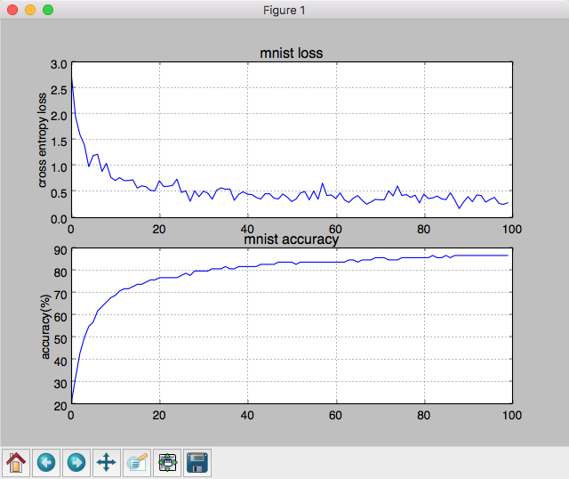

# 神经网络梯度下降与反向传播算法学习

  说明：
  simple_flow是jk个人用python写的深度学习计算的一个非常简易框架。主要目的是为了学习深度学习的过程， 梯度下降算法原理。没有考略到具体的执行效率

## 反向传播原理

  delta_w 怎么设置的

```
  假设loss = sigma((w*x - y)^2)
  为了最小化loss， 我们每次都往loss的下降方向移动delta_loss
  即delta_loss = d(loss)/d(w) * delta_w < 0
  我们将delta_w = - lr * d(loss)/d(w) lr为学习速率一般设置为大于0的数，如0.001
  即： delta_loss = -lr * (d(loss)/d(w))^2
  这样可以保证delta_loss < 0
```

  反向传播推到

```
求导法则: f(g(x)) = f'(g(x)) * g'(x)
记： d(loss)/d(l_1) = delta_l1
l_2 = activate(w * l_1)
d(l_2)/d(l_1) = w*activate_prime(w * l_1)
delta_l1 = d(loss)/d(l_1) = d(loss)/d(l_2)*d(l_2)/d(l_1)
         = delta_l2 * d(l_2)/d(l_1)
         = delta_l2 * w * activate_prime(w * l_1)
d(l_2)/d(w) = activate_prime(w * l_1) * l_1
delta_w = -lr * d(loss)/d(w) = -lr * d(loss)/d(l_2)*d(l_2)/d(w)
        = -lr * delta_l2 * d(l_2)/d(w)
        = -lr * delta_l2 * activate_prime(w * l_1) * l_1
```

## 使用例子

  网络搭建

```
    x = PlaceHolder(name="x", shape=[None, 1])
    y = PlaceHolder(name="y", shape=[None, 1])
    w_1 = Variable(name="w_1", shape=[1, 20])
    b_1 = Variable(name="b_2", shape=[20, ], initializer=ConstantInitializer(0.1))
    w_2 = Variable(name="w_2", shape=[20, 1])
    b_2 = Variable(name="b_2", shape=[1, ], initializer=ConstantInitializer(0.1))
    l_1 = add_flow(add_flow(x, MatMul(w_1), "dot(x, w_1)"),
                   Add(b_1),
                   "dot(x, w_1) + b_1")
    l_1 = add_flow(l_1, Relu(), "relu(l_1)")
    y_pre = add_flow(add_flow(l_1, MatMul(w_2), "dot(l_1, w_2)"),
                     Add(b_2),
                     "dot(l_1, w_2) + b_2")
```

  损失函数

```
    loss = add_flow(
        add_flow(add_flow(add_flow(y_pre, Sub(y), "y_pre - y"),
                          Pow(n=2),
                          "(y_pre - y)^2"),
                 ReduceSum(axis=1),
                 "sum((y_pre - y)^2)"),
        ReduceMean(),
        "loss"
    )
```

  模型解析与训练

```
    model = Model(losses=loss, predicts=y_pre, optimizer=GradientDecent())
    for epoch in range(200):
        batch = np.array(random.sample(zip(x_data, y_data), batch_size))
        x_batch = batch[:, 0]
        y_batch = batch[:, 1]
        feed_dict = {
            x: x_batch,
            y: y_batch
        }
        model.fit(feed_dict=feed_dict, max_train_itr=50, verbose=0)
```

  模型预测

```
    print("gradient decent average loss: ", loss.values)
    y_draw = model.predict(feed_dict={
        x: x_data
    })
    plt.plot(x_data, y_draw, linewidth=3.0, label="min_batch_gradient_decent", color="red")
```

## 效果图

  小批次梯度下降预测一元二次方程曲线
  

  梯度下降与最小二乘法预测一元一次曲线的对比
  

## mnist手写数字识别

  模型

```
    x = PlaceHolder(name="img", shape=[None, 784])  # 28 * 28
    y = PlaceHolder(name="label", shape=[None, 10])  # 10=【0， 9】数字为x的概率label[n]=1 其他为0
    l_1 = dense(x, in_dims=784, out_dims=64, activation_fucntion=Relu(), name="dense_layer_1")
    predict = dense(l_1, in_dims=64, out_dims=10, activation_fucntion=Softmax(), name="predict_dense")
    # 计算交叉熵(Cross-Entropy) h = sigmae(-p(x) * log(predict(x)))
    epsilon = Constant(name="eplison_for_predict", value=[1e-8])
    log_predict = add_flow(
        add_flow(predict, Add(epsilon), name="predict + epsilon"),
        Log(), name="log(predict(x))")
    y_log_predict = add_flow(log_predict, Multify(y), name="y * log(predict)")
    loss = add_flow(y_log_predict, ReduceSum(axis=1), name="reduce_sum(y * log(p))")
    loss = add_flow(loss, Multify(Constant(name="-1", value=-1.0)), name="-reduce_sum(y * log(p))")
    loss = add_flow(loss, ReduceMean(), name="loss")
```

  训练效果

  

```
('epoch ', 0, 'loss: ', 2.8043772382662313)
('accuracy:', 20)
('epoch ', 1, 'loss: ', 1.9484563920498141)
('accuracy:', 32)
('epoch ', 2, 'loss: ', 1.6021121153462525)
('accuracy:', 43)
('epoch ', 3, 'loss: ', 1.4089412051790293)
('accuracy:', 50)
('epoch ', 4, 'loss: ', 0.986287683149735)
('accuracy:', 55)
('epoch ', 5, 'loss: ', 1.1999923308724798)
('accuracy:', 57)
('epoch ', 6, 'loss: ', 1.2248282683719787)
('accuracy:', 62)
('epoch ', 7, 'loss: ', 0.8927438451538785)
('accuracy:', 64)
('epoch ', 8, 'loss: ', 1.0498145306133193)
('accuracy:', 66)
('epoch ', 9, 'loss: ', 0.781277079475772)
('accuracy:', 68)
('epoch ', 10, 'loss: ', 0.7180186855751094)
('accuracy:', 69)
('epoch ', 11, 'loss: ', 0.77391273786389)
('accuracy:', 71)
('epoch ', 12, 'loss: ', 0.7161499016774261)
('accuracy:', 72)
('epoch ', 13, 'loss: ', 0.7182349487718694)
('accuracy:', 72)
('epoch ', 14, 'loss: ', 0.7316733135055642)
('accuracy:', 73)
('epoch ', 15, 'loss: ', 0.5721017281797921)
('accuracy:', 74)
('epoch ', 16, 'loss: ', 0.6154299260942812)
('accuracy:', 74)
('epoch ', 17, 'loss: ', 0.5980521177344628)
('accuracy:', 75)
('epoch ', 18, 'loss: ', 0.5295399025477827)
('accuracy:', 76)
('epoch ', 19, 'loss: ', 0.517718152622905)
('accuracy:', 76)
('epoch ', 20, 'loss: ', 0.7130423325001434)
('accuracy:', 77)
('epoch ', 21, 'loss: ', 0.603144444276561)
('accuracy:', 77)
('epoch ', 22, 'loss: ', 0.6070522439503283)
('accuracy:', 77)
('epoch ', 23, 'loss: ', 0.623636272646564)
('accuracy:', 77)
('epoch ', 24, 'loss: ', 0.7458397357158313)
('accuracy:', 77)
('epoch ', 25, 'loss: ', 0.4879570271140532)
('accuracy:', 78)
('epoch ', 26, 'loss: ', 0.5192566134431899)
('accuracy:', 79)
('epoch ', 27, 'loss: ', 0.31754342018187454)
('accuracy:', 78)
('epoch ', 28, 'loss: ', 0.5188452206346957)
('accuracy:', 80)
('epoch ', 29, 'loss: ', 0.4046661941988438)
('accuracy:', 80)
('epoch ', 30, 'loss: ', 0.5148456689456397)
('accuracy:', 80)
('epoch ', 31, 'loss: ', 0.4729698521075227)
('accuracy:', 80)
('epoch ', 32, 'loss: ', 0.3589076956622746)
('accuracy:', 81)
('epoch ', 33, 'loss: ', 0.5314614850136938)
('accuracy:', 81)
('epoch ', 34, 'loss: ', 0.5763792556832066)
('accuracy:', 81)
('epoch ', 35, 'loss: ', 0.5495031873140805)
('accuracy:', 82)
('epoch ', 36, 'loss: ', 0.5536873692434763)
('accuracy:', 81)
('epoch ', 37, 'loss: ', 0.33667030363738315)
('accuracy:', 81)
('epoch ', 38, 'loss: ', 0.4506617238982078)
('accuracy:', 82)
('epoch ', 39, 'loss: ', 0.49957511774910585)
('accuracy:', 82)
('epoch ', 40, 'loss: ', 0.45556970972533056)
('accuracy:', 82)
('epoch ', 41, 'loss: ', 0.4463034773269716)
('accuracy:', 82)
('epoch ', 42, 'loss: ', 0.39060232168171427)
('accuracy:', 82)
('epoch ', 43, 'loss: ', 0.3614698868665358)
('accuracy:', 83)
('epoch ', 44, 'loss: ', 0.46304537161634274)
('accuracy:', 83)
('epoch ', 45, 'loss: ', 0.4627190474247638)
('accuracy:', 83)
('epoch ', 46, 'loss: ', 0.3772658845250952)
('accuracy:', 83)
('epoch ', 47, 'loss: ', 0.36236427949871586)
('accuracy:', 84)
('epoch ', 48, 'loss: ', 0.4583440810306787)
('accuracy:', 84)
('epoch ', 49, 'loss: ', 0.39873171057952106)
('accuracy:', 84)
('epoch ', 50, 'loss: ', 0.31287072858777376)
('accuracy:', 84)
('epoch ', 51, 'loss: ', 0.36021768421063965)
('accuracy:', 83)
('epoch ', 52, 'loss: ', 0.4792476915050705)
('accuracy:', 84)
('epoch ', 53, 'loss: ', 0.5046472631676613)
('accuracy:', 84)
('epoch ', 54, 'loss: ', 0.34597023142728434)
('accuracy:', 84)
('epoch ', 55, 'loss: ', 0.5156149121353298)
('accuracy:', 84)
('epoch ', 56, 'loss: ', 0.3569471300033149)
('accuracy:', 84)
('epoch ', 57, 'loss: ', 0.6673581832767528)
('accuracy:', 84)
('epoch ', 58, 'loss: ', 0.42727626152670806)
('accuracy:', 84)
('epoch ', 59, 'loss: ', 0.44160852565128067)
('accuracy:', 84)
('epoch ', 60, 'loss: ', 0.3711708301698556)
('accuracy:', 84)
('epoch ', 61, 'loss: ', 0.4804166297046855)
('accuracy:', 84)
('epoch ', 62, 'loss: ', 0.3413553011200753)
('accuracy:', 84)
('epoch ', 63, 'loss: ', 0.29521991689520777)
('accuracy:', 85)
('epoch ', 64, 'loss: ', 0.37751961914471993)
('accuracy:', 85)
('epoch ', 65, 'loss: ', 0.42784883507793026)
('accuracy:', 84)
('epoch ', 66, 'loss: ', 0.33526962140068334)
('accuracy:', 85)
('epoch ', 67, 'loss: ', 0.2620475383584452)
('accuracy:', 85)
('epoch ', 68, 'loss: ', 0.30430790219065146)
('accuracy:', 85)
('epoch ', 69, 'loss: ', 0.3546996610791862)
('accuracy:', 86)
('epoch ', 70, 'loss: ', 0.34545340768456545)
('accuracy:', 86)
('epoch ', 71, 'loss: ', 0.3453038249593054)
('accuracy:', 86)
('epoch ', 72, 'loss: ', 0.5187912016355932)
('accuracy:', 85)
('epoch ', 73, 'loss: ', 0.42117178172387143)
('accuracy:', 85)
('epoch ', 74, 'loss: ', 0.6122717265365573)
('accuracy:', 85)
('epoch ', 75, 'loss: ', 0.4296252780700278)
('accuracy:', 86)
('epoch ', 76, 'loss: ', 0.4465877388881323)
('accuracy:', 86)
('epoch ', 77, 'loss: ', 0.3935202778198414)
('accuracy:', 86)
('epoch ', 78, 'loss: ', 0.43650955619547316)
('accuracy:', 86)
('epoch ', 79, 'loss: ', 0.28536088328958537)
('accuracy:', 86)
('epoch ', 80, 'loss: ', 0.4572017815883804)
('accuracy:', 86)
('epoch ', 81, 'loss: ', 0.3704221053857836)
('accuracy:', 86)
('epoch ', 82, 'loss: ', 0.382647577244061)
('accuracy:', 87)
('epoch ', 83, 'loss: ', 0.41935447342805565)
('accuracy:', 86)
('epoch ', 84, 'loss: ', 0.36399983174382344)
('accuracy:', 86)
('epoch ', 85, 'loss: ', 0.34980196962702154)
('accuracy:', 87)
('epoch ', 86, 'loss: ', 0.4809451148540599)
('accuracy:', 86)
('epoch ', 87, 'loss: ', 0.34151757814466116)
('accuracy:', 87)
('epoch ', 88, 'loss: ', 0.17720899129087783)
('accuracy:', 87)
('epoch ', 89, 'loss: ', 0.3027760224945203)
('accuracy:', 87)
('epoch ', 90, 'loss: ', 0.4070810858243496)
('accuracy:', 87)
('epoch ', 91, 'loss: ', 0.30987113789063536)
('accuracy:', 87)
('epoch ', 92, 'loss: ', 0.4410072856380151)
('accuracy:', 87)
('epoch ', 93, 'loss: ', 0.42743643780907375)
('accuracy:', 87)
('epoch ', 94, 'loss: ', 0.3011564566191058)
('accuracy:', 87)
('epoch ', 95, 'loss: ', 0.35214509610664707)
('accuracy:', 87)
('epoch ', 96, 'loss: ', 0.3924368353437736)
('accuracy:', 87)
('epoch ', 97, 'loss: ', 0.27854945305288065)
('accuracy:', 87)
('epoch ', 98, 'loss: ', 0.256371690187675)
('accuracy:', 87)
('epoch ', 99, 'loss: ', 0.28978310746358976)
('accuracy:', 87)
```
