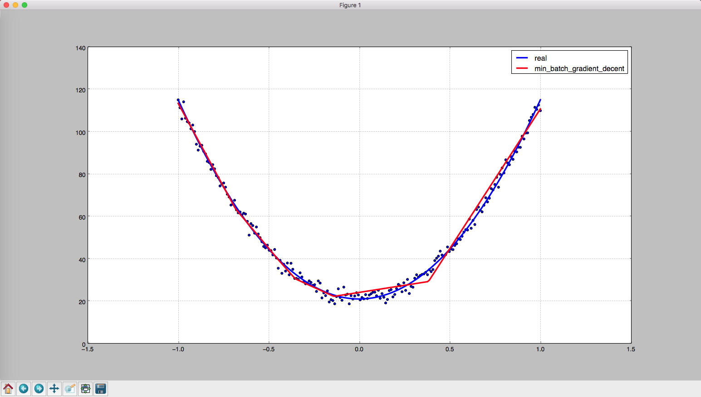
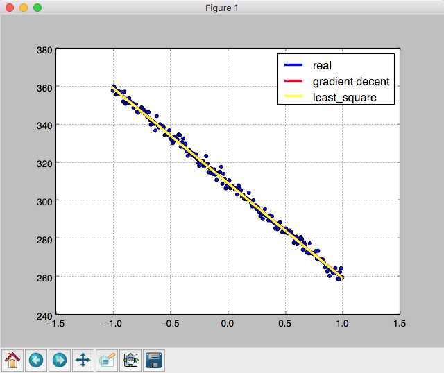

# 神经网络梯段下降与反向传播算法学习


## 反向传播原理

  delta_w 怎么设置的

```
  假设loss = sigma((w*x - y)^2)
  为了最小化loss， 我们每次都往loss的下降方向移动delta_loss
  即delta_loss = d(loss)/d(w) * delta_w < 0
  我们将delta_w = - lr * d(loss)/d(w) lr为学习速率一般设置为大于0的数，如0.001
  即： delta_loss = -lr * (d(loss)/d(w))^2
  这样可以保证delta_loss < 0
```

  反向传播推到

```
求导法则: f(g(x)) = f'(g(x)) * g'(x)
记： d(loss)/d(l_1) = delta_l1
l_2 = activate(w * l_1)
d(l_2)/d(l_1) = w*activate_prime(w * l_1)
delta_l1 = d(loss)/d(l_1) = d(loss)/d(l_2)*d(l_2)/d(l_1)
         = delta_l2 * d(l_2)/d(l_1)
         = delta_l2 * w * activate_prime(w * l_1)
d(l_2)/d(w) = activate_prime(w * l_1) * l_1
delta_w = -lr * d(loss)/d(w) = -lr * d(loss)/d(l_2)*d(l_2)/d(w)
        = -lr * delta_l2 * d(l_2)/d(w)
        = -lr * delta_l2 * activate_prime(w * l_1) * l_1
```

## 使用例子

  网络搭建

```
    x = PlaceHolder(name="x", shape=[None, 1])
    y = PlaceHolder(name="y", shape=[None, 1])
    w_1 = Variable(name="w_1", shape=[1, 20])
    b_1 = Variable(name="b_2", shape=[20, ], initializer=ConstantInitializer(0.1))
    w_2 = Variable(name="w_2", shape=[20, 1])
    b_2 = Variable(name="b_2", shape=[1, ], initializer=ConstantInitializer(0.1))
    l_1 = add_flow(add_flow(x, MatMul(w_1), "dot(x, w_1)"),
                   Add(b_1),
                   "dot(x, w_1) + b_1")
    l_1 = add_flow(l_1, Relu(), "relu(l_1)")
    y_pre = add_flow(add_flow(l_1, MatMul(w_2), "dot(l_1, w_2)"),
                     Add(b_2),
                     "dot(l_1, w_2) + b_2")
```

  损失函数

```
    loss = add_flow(
        add_flow(add_flow(add_flow(y_pre, Sub(y), "y_pre - y"),
                          Pow(n=2),
                          "(y_pre - y)^2"),
                 ReduceSum(axis=1),
                 "sum((y_pre - y)^2)"),
        ReduceMean(),
        "loss"
    )
```

  模型解析与训练

```
    model = Model(losses=loss, predicts=y_pre, optimizer=GradientDecent())
    for epoch in range(200):
        batch = np.array(random.sample(zip(x_data, y_data), batch_size))
        x_batch = batch[:, 0]
        y_batch = batch[:, 1]
        feed_dict = {
            x: x_batch,
            y: y_batch
        }
        model.fit(feed_dict=feed_dict, max_train_itr=50, verbose=0)
```

  模型预测

```
    print("gradient decent average loss: ", loss.values)
    y_draw = model.predict(feed_dict={
        x: x_data
    })
    plt.plot(x_data, y_draw, linewidth=3.0, label="min_batch_gradient_decent", color="red")
```

## 效果图

  小批次梯度下降预测一元二次方程曲线
  

  梯度下降与最小二乘法预测一元一次曲线的对比
  